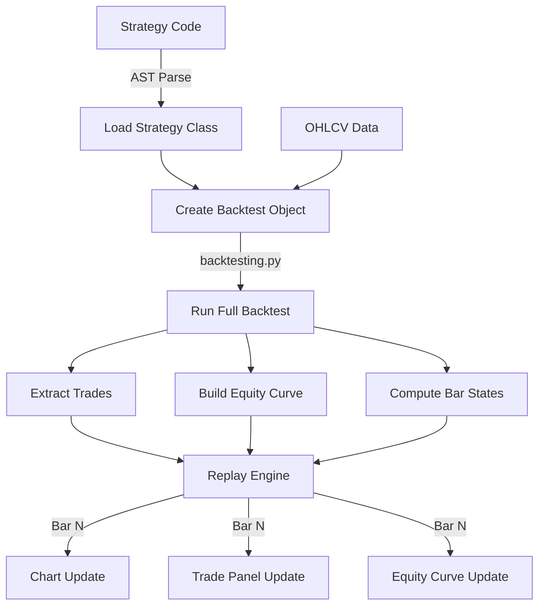

<p align="center">
  <h1 align="center">📊 Visual Backtest Terminal</h1>
  <p align="center">
    <strong>Professional-grade visual backtesting platform with bar-by-bar replay, strategy optimization, and walk-forward analysis</strong>
  </p>
  <p align="center">
    
    
    
    
  </p>
</p>

---

## Table of Contents

- [Overview](#overview)
- [Key Features](#key-features)
- [Architecture](#architecture)
- [Installation](#installation)
- [Quick Start](#quick-start)
- [User Guide](#user-guide)
  - [Data Manager](#data-manager)
  - [Strategy Editor](#strategy-editor)
  - [Visual Replay](#visual-replay)
  - [Strategy Optimization](#strategy-optimization)
  - [Walk-Forward Analysis](#walk-forward-analysis)
  - [PDF Export](#pdf-export)
- [Project Structure](#project-structure)
- [Writing Custom Strategies](#writing-custom-strategies)
- [Configuration](#configuration)
- [Technical Details](#technical-details)
- [Author](#author)

---

## Overview

**Visual Backtest Terminal** is a desktop trading strategy backtesting application inspired by MetaTrader 5's visual tester. It provides a complete workflow for developing, testing, optimizing, and validating quantitative trading strategies — all within a sleek, professional dark-themed interface.

Built on top of the [`backtesting.py`](https://github.com/kernc/backtesting.py) engine, this application adds:

- 🎬 **Bar-by-bar visual replay** with playback controls (play/pause/step/speed)
- 📈 **Live candlestick charts** with trade markers and indicator overlays
- ⚡ **Grid-search optimization** with heatmap/bar chart visualizations
- 🔄 **Walk-forward analysis** with per-window optimization and dynamic parameter scheduling
- 📄 **PDF report generation** with detailed statistics and equity curves
- 💾 **SQLite data caching** with integrated Yahoo Finance data manager

---

## Key Features

### 🎬 Visual Bar-by-Bar Replay
| Feature | Description |
|---------|-------------|
| **Transport Controls** | Play, Pause, Step Forward/Back, Jump to Start/End |
| **Variable Speed** | 6 speed levels from 1x (slow) to Max (instant) |
| **Live Chart** | Candlestick chart updates in real-time during replay |
| **Trade Markers** | Entry/exit arrows appear on the chart as trades execute |
| **Indicator Overlay** | Strategy indicators plotted as overlays on the price chart |
| **Equity Curve** | Collapsible equity, closed P/L, and floating P/L panel |

### 📊 Strategy Analysis
| Feature | Description |
|---------|-------------|
| **Results Panel** | 25+ backtest metrics grouped by Performance, Risk, Trades, Account |
| **Open Trades** | Real-time floating P/L for all currently open positions |
| **Trade History** | Full closed trade log with entry/exit prices and P/L |
| **Color Coding** | Green/red highlighting for positive/negative metrics |

### ⚡ Strategy Optimization
| Feature | Description |
|---------|-------------|
| **AST Parameter Detection** | Automatically scans strategy code for optimizable parameters |
| **Grid Search** | Exhaustive search over all parameter combinations |
| **Multiple Metrics** | Maximize by Return, Sharpe, Sortino, SQN, Win Rate, or Equity |
| **Visualization** | Bar chart (1 param), Heatmap (2 params), Sorted chart (3+) |
| **Apply Results** | One-click apply best parameters back to strategy code |

### 🔄 Walk-Forward Analysis
| Feature | Description |
|---------|-------------|
| **Manual Window Control** | Set number of windows, per-row train/test bar counts |
| **Contiguous Test Periods** | Test windows chain together with no gaps |
| **Parameter Selection** | Choose which parameters to optimize with min/max/step |
| **Visual Timeline** | Color-coded rectangles showing train (IS) and test (OOS) windows |
| **Dynamic Parameters** | Generated wrapper strategy switches params at window boundaries |
| **Combined Replay** | Load all OOS windows as single dataset for replay |

### 💾 Data Management
| Feature | Description |
|---------|-------------|
| **Yahoo Finance** | Download OHLCV data for any ticker via yfinance |
| **Ticker Search** | Search companies by name, auto-complete ticker symbols |
| **SQLite Cache** | All downloaded data cached locally in `market_data.db` |
| **Data Manager** | Browse, download, and delete cached datasets via GUI |
| **Flexible Periods** | Support for multiple timeframes and date ranges |

---

## Architecture

```
┌───────────────────────────────────────────────────────────────┐
│                        main.py                                │
│              (Application Entry + Global Theme)               │
└──────────────────────┬────────────────────────────────────────┘
                       │
          ┌────────────▼────────────┐
          │     gui/main_window.py  │
          │   (Central Orchestrator)│
          └──┬───┬───┬───┬───┬───┬──┘
             │   │   │   │   │   │
     ┌───────┘   │   │   │   │   └────────┐
     ▼           ▼   │   ▼   ▼            ▼
  strategy_   chart_ │  trades_ results_  controls_
  editor.py  widget  │  panel   panel     widget
             .py     │  .py     .py       .py
                     ▼
               equity_curve.py

  ┌─────────────────────────────────────────────┐
  │           Dialog Windows                    │
  │  ┌──────────────┐  ┌──────────────────────┐ │
  │  │ optimizer_    │  │ walkforward_        │ │
  │  │ dialog.py     │  │ dialog.py           │ │
  │  └──────────────┘  └──────────────────────┘ │
  │  ┌──────────────┐  ┌──────────────────────┐ │
  │  │ data_manager  │  │ pdf_export.py       │ │
  │  │ .py           │  │                     │ │
  │  └──────────────┘  └──────────────────────┘ │
  └─────────────────────────────────────────────┘

  ┌─────────────────────────────────────────────┐
  │           Backend                           │
  │  ┌──────────────┐  ┌──────────────────────┐ │
  │  │ backtest_    │  │ data_cache.py        │ │
  │  │ engine.py     │  │ (SQLite)            │ │
  │  └──────────────┘  └──────────────────────┘ │
  │  ┌──────────────┐                           │
  │  │ data_fetcher │                           │
  │  │ .py          │                           │
  │  └──────────────┘                           │
  └─────────────────────────────────────────────┘
```

### Component Responsibilities

| Component | File | Lines | Purpose |
|-----------|------|-------|---------|
| **Entry Point** | `main.py` | ~440 | Application bootstrap, global theme (375-line QSS), dark palette |
| **Main Window** | `gui/main_window.py` | ~530 | Central orchestrator, signal wiring, state management |
| **Chart** | `gui/chart_widget.py` | ~300 | Matplotlib candlestick chart with trade markers, indicators |
| **Strategy Editor** | `gui/strategy_editor.py` | ~390 | Code editor with syntax-appropriate font, load/save/run |
| **Controls** | `gui/controls_widget.py` | ~400 | Playback transport, speed slider, progress bar, account strip |
| **Trades Panel** | `gui/trades_panel.py` | ~160 | Open/closed trades tables with tabs |
| **Results Panel** | `gui/results_panel.py` | ~200 | Grouped backtest statistics with color-coded values |
| **Equity Curve** | `gui/equity_curve.py` | ~250 | Collapsible equity + closed P/L + floating P/L chart |
| **Optimizer** | `gui/optimizer_dialog.py` | ~430 | AST param detection, grid optimization, heatmap, apply |
| **Walk-Forward** | `gui/walkforward_dialog.py` | ~620 | Rolling WF analysis, per-row windows, dynamic params |
| **Data Manager** | `gui/data_manager.py` | ~430 | Ticker search, download, cache browser, delete |
| **PDF Export** | `gui/pdf_export.py` | ~300 | Multi-page PDF reports with charts and statistics |
| **Backtest Engine** | `backtest_engine.py` | ~380 | Strategy loading, backtest execution, bar-state extraction |
| **Data Cache** | `data_cache.py` | ~160 | SQLite CRUD for OHLCV datasets |
| **Data Fetcher** | `data_fetcher.py` | ~100 | Yahoo Finance download wrapper |

---

## Installation

### Prerequisites

- **Python 3.10+** (recommended: 3.11 or 3.12)
- **pip** package manager

### Setup

```bash
# 1. Clone or download the project
git clone <repository-url>
cd azure-chromosphere

# 2. Create virtual environment
python -m venv .venv

# 3. Activate environment
# Windows:
.venv\Scripts\activate
# macOS/Linux:
source .venv/bin/activate

# 4. Install dependencies
pip install -r requirements.txt
```

### Dependencies

| Package | Version | Purpose |
|---------|---------|---------|
| `backtesting` | ≥0.3.3 | Core backtest engine with `optimize()` |
| `yfinance` | ≥0.2.0 | Yahoo Finance data download |
| `PyQt5` | ≥5.15 | Desktop GUI framework |
| `matplotlib` | ≥3.7 | Charts, candlesticks, PDF generation |
| `mplfinance` | ≥0.12 | Candlestick chart rendering |
| `pandas` | ≥2.0 | DataFrame operations |
| `numpy` | ≥1.24 | Numerical computations |

---

## Quick Start

```bash
# Launch the application
python main.py
```

### First Run Workflow

1. **Load Data** — Click `Data Manager` → search for a ticker (e.g., "AAPL") → Download
2. **Select Dataset** — Double-click a cached dataset to load it
3. **Write Strategy** — Edit the default SMA Crossover strategy or load a `.py` file
4. **Run Backtest** — Click `▶ Run Backtest` to execute
5. **Replay** — Use playback controls to step through bars and watch trades unfold
6. **Analyze** — Review results in the right panel, equity curve below the chart

---

## User Guide

### Data Manager

The Data Manager provides a complete interface for acquiring and managing market data.

**Opening:** Click the `Data Manager` button in the bottom controls bar.

**Features:**
- **Search:** Type a company name or ticker symbol → click Search → select from results
- **Download:** Choose Period (1mo, 3mo, 6mo, 1y, 2y, 5y, max) and Interval (1m, 5m, 15m, 1h, 1d, 1wk) → Download
- **Cache:** All data is stored in `market_data.db` (SQLite) with metadata (ticker, period, interval, bar count, date range)
- **Load:** Double-click any cached dataset to load it into the main window
- **Delete:** Select a dataset → click Delete to remove from cache

### Strategy Editor

The built-in code editor lets you write, load, save, and execute strategies.

**Toolbar:**
| Button | Action |
|--------|--------|
| `Load` | Open a `.py` strategy file from disk |
| `Save` | Save the current code to a `.py` file |
| `Optimize` | Open the Strategy Optimizer dialog |
| `Walk-Forward` | Open the Walk-Forward Analysis dialog |
| `▶ Run Backtest` | Execute the strategy and start replay |

**Strategy Requirements:**
- Must contain a class inheriting from `backtesting.Strategy`
- Must implement `init()` and `next()` methods
- Can import any standard library or installed packages

### Visual Replay

After running a backtest, the visual replay system provides a bar-by-bar walkthrough.

**Playback Controls:**
| Control | Action |
|---------|--------|
| ⏮ | Jump to first bar |
| ⏪ | Step backward one bar |
| ▶/⏸ | Play / Pause automatic playback |
| ⏩ | Step forward one bar |
| ⏭ | Jump to last bar |
| Speed Slider | Adjust playback speed (1x → Max) |

**During Replay:**
- Candlestick chart grows bar by bar
- Trade entry/exit arrows appear in real-time
- Open trades show floating P/L
- Equity curve updates continuously
- Closed trade history accumulates
- Account balance/equity/floating P/L shown in the info strip

### Strategy Optimization

The optimizer performs exhaustive grid-search over parameter combinations.

**Workflow:**
1. Open optimizer via `Optimize` button
2. Parameters are auto-detected from your strategy code using AST parsing
3. Enable/disable parameters with checkboxes
4. Set Min, Max, Step for each parameter
5. Select maximization metric (Return, Sharpe, Sortino, SQN, Win Rate, Equity)
6. Click `Run Optimization`
7. Review results in chart + table
8. Click `Apply Selected Parameters` to update strategy code

**Visualization:**
- **1 parameter** → Bar chart
- **2 parameters** → Heatmap with color gradient
- **3+ parameters** → Sorted bar chart by metric

### Walk-Forward Analysis

Walk-forward analysis validates that optimized parameters generalize to unseen data.

**Concept:**
```
Window 1:  [====TRAIN====][TEST]
Window 2:       [====TRAIN====][TEST]
Window 3:            [====TRAIN====][TEST]
Window 4:                 [====TRAIN====][TEST]
                                              ↑
                    Test periods are contiguous (no gaps)
```

**Workflow:**
1. Open via `Walk-Forward` button
2. Set number of windows (rows) with the spinner
3. **Per row:** Adjust Train bars and Test bars individually
4. Select which parameters to optimize (checkboxes + Min/Max/Step)
5. Click `Run Walk-Forward`
6. For each window: optimize on training data → backtest on test data
7. Results shown in table: Best Params, Return%, MaxDD%, WinRate%, Sharpe
8. Visual timeline: orange = training, green/red = test (by return)
9. `Load Combined to Replay` → loads all OOS data with dynamic parameter switching

**Dynamic Parameters:** The generated wrapper strategy automatically switches parameters at window boundaries during replay, giving you a realistic simulation of rolling optimization.

### PDF Export

Export professional backtest reports to PDF.

**Contents:**
- Cover page with strategy name and author
- Candlestick chart with trade markers
- Equity curve
- Full statistics table
- Trade log
- Custom footer: *Króner Barnabás Zsolt*

**Trigger:** Click `Export PDF` after completing a backtest (button in bottom controls).

---

## Project Structure

```
azure-chromosphere/
├── main.py                    # App entry point + global theme
├── backtest_engine.py         # Core: strategy loading, backtest, replay state
├── data_cache.py              # SQLite CRUD for OHLCV data
├── data_fetcher.py            # Yahoo Finance download wrapper
├── requirements.txt           # Python dependencies
├── market_data.db             # SQLite database (auto-created)
│
├── gui/
│   ├── __init__.py
│   ├── main_window.py         # Central window & orchestrator
│   ├── chart_widget.py        # Candlestick chart (matplotlib)
│   ├── strategy_editor.py     # Code editor + toolbar
│   ├── controls_widget.py     # Playback controls + account info
│   ├── trades_panel.py        # Open/closed trades tables
│   ├── results_panel.py       # Backtest statistics panel
│   ├── equity_curve.py        # Equity / P&L chart
│   ├── optimizer_dialog.py    # Strategy optimization dialog
│   ├── walkforward_dialog.py  # Walk-forward analysis dialog
│   ├── data_manager.py        # Data download & cache manager
│   └── pdf_export.py          # PDF report generation
│
└── strategies/
    ├── sma_cross.py           # SMA Crossover example
    └── orb.py                 # Opening Range Breakout strategy
```

---

## Writing Custom Strategies

Strategies follow the [`backtesting.py`](https://kernc.github.io/backtesting.py/) API:

```python
from backtesting import Strategy
from backtesting.lib import crossover
from backtesting.test import SMA

class SmaCross(Strategy):
    # Class-level parameters (auto-detected by optimizer)
    n1 = 10    # Fast SMA period
    n2 = 20    # Slow SMA period

    def init(self):
        close = self.data.Close
        self.sma1 = self.I(SMA, close, self.n1)
        self.sma2 = self.I(SMA, close, self.n2)

    def next(self):
        if crossover(self.sma1, self.sma2):
            self.buy()
        elif crossover(self.sma2, self.sma1):
            self.sell()
```

### Rules for Optimizable Parameters

The optimizer auto-detects parameters that are:
- **Class-level attributes** (not inside `__init__`, `init`, or `next`)
- **Numeric type** (`int` or `float`)
- **Simple assignments** (e.g., `n1 = 10`, not `n1 = some_function()`)

### Tips

- Use `self.I()` to register indicators — they'll appear on the chart
- Use `self.buy()` / `self.sell()` for market orders
- Use `self.position.close()` to close current position
- Set `exclusive_orders=True` in backtest for single-position mode

---

## Configuration

### Initial Cash

Set via the `Cash` spinner in the bottom controls bar (default: $10,000).

### Chart Colors

| Element | Color |
|---------|-------|
| Bullish candle | `#26A69A` (teal green) |
| Bearish candle | `#EF5350` (red) |
| Background | `#0D0E16` (deep dark) |
| Grid | `#1C1D2E` |
| Buy marker | `#00E676` (bright green) |
| Sell marker | `#FF1744` (bright red) |

### Theme

The application uses a comprehensive **380-line** global QSS stylesheet providing a Bloomberg Terminal / TradingView-inspired professional dark theme across all widgets.

---

## Technical Details

### Backtest Engine Flow



### Signal Architecture

The application uses PyQt5's signal/slot mechanism for decoupled communication:

```
StrategyEditor
  ├── run_backtest_requested(str)    → MainWindow._on_run_backtest()
  ├── optimize_requested(str)        → MainWindow._on_optimize()
  └── walkforward_requested(str)     → MainWindow._on_walkforward()

ControlsWidget
  ├── play_toggled(bool)             → MainWindow._on_play_toggle()
  ├── step_forward()                 → MainWindow._on_step_forward()
  ├── step_backward()                → MainWindow._on_step_backward()
  ├── go_to_start()                  → MainWindow._on_go_to_start()
  ├── go_to_end()                    → MainWindow._on_go_to_end()
  ├── speed_changed(int)             → MainWindow._on_speed_changed()
  ├── export_requested()             → MainWindow._on_export_pdf()
  └── open_data_manager()            → MainWindow._on_open_data_manager()

OptimizerDialog
  └── optimized_code(str)            → MainWindow._on_optimized_code()

WalkForwardDialog
  └── result_ready(obj, obj, str)    → MainWindow._on_walkforward_result()
```

### SQLite Schema

```sql
-- datasets table
CREATE TABLE datasets (
    id          INTEGER PRIMARY KEY AUTOINCREMENT,
    ticker      TEXT NOT NULL,
    period      TEXT NOT NULL,
    interval    TEXT NOT NULL,
    bars        INTEGER,
    start_date  TEXT,
    end_date    TEXT,
    created_at  TIMESTAMP DEFAULT CURRENT_TIMESTAMP
);

-- ohlcv_data table
CREATE TABLE ohlcv_data (
    dataset_id  INTEGER REFERENCES datasets(id),
    timestamp   TEXT NOT NULL,
    open        REAL, high REAL, low REAL, close REAL,
    volume      REAL,
    PRIMARY KEY (dataset_id, timestamp)
);
```

---

## Author

**Króner Barnabás Zsolt**

---

<p align="center">
  <sub>Built with ❤️ using Python, PyQt5, backtesting.py, and matplotlib</sub>
</p>
